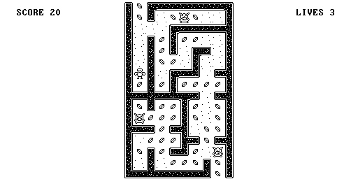

# Chicken Maze 

The mini version for the Hack platform

## About this project

This game [From Nand to Tetris](https://www.nand2tetris.org/). This game was created to provide LÖVE developers with a fully completed project to refer to when creating their own games.

This game was developed as an exercise in the ["From Nand to Tetris"](https://www.nand2tetris.org/) course. It is programmed in the language Jack runs on the minimal computer platform Hack. To start please download the VM-Emulator. To compile please use the Jack compiler. ([Download Software](https://www.nand2tetris.org/software))

